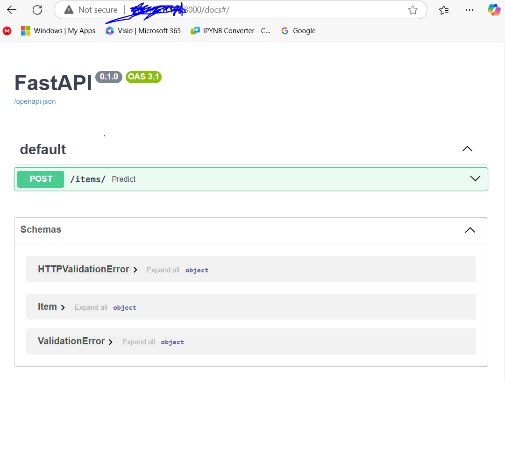

# Exercise 2: Iris Model Training and Deployment

This document provides a step-by-step guide to training a Random Forest model using the Iris dataset and deploying it as a prediction service with Flask and FastAPI.

---

## **1. Project Overview**

Here is the Output Image 



### **File Structure**
```plaintext
.
├── train.py            # Script to train and save the model
├── iris_model.py       # Flask and FastAPI implementation for predictions
├── model.joblib        # Trained model saved using Joblib
├── Dockerfile          # Docker configuration for containerization
├── requirements.txt    # Required dependencies for the project
```

---

## **2. Model Training**

### **train.py**
This script trains a Random Forest classifier using the Iris dataset, splits the data into train and test sets, and saves the trained model as `model.joblib`.

#### **Code**
```python
import pandas as pd
from sklearn.datasets import load_iris
from sklearn.model_selection import train_test_split
from sklearn.ensemble import RandomForestClassifier
import joblib

print("Load Data")
data = load_iris()

X = pd.DataFrame(data.data, columns=data.feature_names)
y = pd.DataFrame(data.target, columns=["target"])

print("Splitting the data")
X_train, X_test, y_train, y_test = train_test_split(X, y, test_size=0.2, random_state=42)

print("Train Model")
model = RandomForestClassifier()
model.fit(X_train, y_train.values.ravel())

print("Saving the model")
joblib.dump(model, "model.joblib")
```

#### **Steps to Execute**
1. Install the required dependencies:
   ```bash
   pip install pandas scikit-learn joblib
   ```
2. Run the training script:
   ```bash
   python train.py
   ```

   This will generate the `model.joblib` file.

---

## **3. Flask API for Prediction**

### **iris_model.py (Flask Section)**
A lightweight Flask application to serve the prediction functionality.

#### **Code**
```python
from flask import Flask, request, jsonify
import joblib
import numpy as np

app = Flask(__name__)

model = joblib.load("model.joblib")

@app.route("/predict", methods=["POST"])
def predict():
    data = request.json
    prediction = model.predict(np.array(data["input"]).reshape(1, -1))
    return jsonify({"prediction": prediction.tolist()})

if __name__ == "__main__":
    app.run(debug=True, host="127.0.0.1")
```

#### **Steps to Execute**
1. Install Flask:
   ```bash
   pip install flask
   ```
2. Run the Flask API server:
   ```bash
   flask --app iris_model run
   # OR
   python iris_model.py
   ```

3. Test the Flask API:
   - Send a POST request to `http://127.0.0.1:5000/predict` with this JSON payload:
     ```json
     {
       "input": [5.1, 3.5, 1.4, 0.2]
     }
     ```
   - Expected Response:
     ```json
     {
       "prediction": [0]
     }
     ```

---

## **4. FastAPI for Prediction**

### **iris_model.py (FastAPI Section)**
A FastAPI implementation for modern, scalable APIs.

#### **Code**
```python
from fastapi import FastAPI
from pydantic import BaseModel
import joblib
import numpy as np

app = FastAPI()

class Item(BaseModel):
    feature1: float
    feature2: float
    feature3: float
    feature4: float

@app.post("/items/")
async def predict(item: Item):
    model = joblib.load("model.joblib")
    prediction = model.predict(
        np.array([item.feature1, item.feature2, item.feature3, item.feature4]).reshape(1, -1)
    )
    return {"prediction": prediction.tolist()}
```

#### **Steps to Execute**
1. Install FastAPI and Uvicorn:
   ```bash
   pip install fastapi uvicorn joblib numpy
   ```

2. Run the FastAPI server:
   ```bash
   uvicorn iris_model:app --host 0.0.0.0 --port 8000 --reload
   ```

3. Access the FastAPI Swagger Documentation:
   - Local Access:
     Open in your browser: [http://127.0.0.1:8000/docs](http://127.0.0.1:8000/docs)
   - Network Access:
     Find your machine's IP address:
     ```bash
     ipconfig
     ```
     Open `http://<your-ip>:8000/docs` in a browser on another device.

4. Test the API via Swagger UI:
   - Enter the JSON payload:
     ```json
     {
       "feature1": 5.1,
       "feature2": 3.5,
       "feature3": 1.4,
       "feature4": 0.2
     }
     ```
   - Expected Response:
     ```json
     {
       "prediction": [0]
     }
     ```

---

## **5. Using Curl**
You can also test the APIs using curl:
```bash
curl -X POST http://127.0.0.1:8000/items/ \
-H "Content-Type: application/json" \
-d '{"feature1": 5.1, "feature2": 3.5, "feature3": 1.4, "feature4": 0.2}'
```

---

## **6. Docker Deployment**

### **Dockerfile**
The Dockerfile builds a container for the API (Flask/ FastAPI).

#### **Code**
```dockerfile
FROM python:3.10-slim
WORKDIR /app
COPY requirements.txt requirements.txt
RUN pip install -r requirements.txt
COPY . .
CMD ["python", "iris_model.py"]
```

### **requirements.txt**
List of required dependencies:
```
flask
fastapi
uvicorn
joblib
numpy
pandas
scikit-learn
```

#### **Steps to Build and Run**
1. Build the Docker image:
   ```bash
   docker build -t iris_model .
   ```

2. Run the Docker container:
   ```bash
   docker run -p 8000:8000 iris_model
   ```

   The API is accessible at [http://127.0.0.1:8000](http://127.0.0.1:8000).

---

## **7. Notes on Server Access**
- If testing from another device:
  - Replace `127.0.0.1` with your machine’s IP address (find using `ipconfig`).
  - Ensure the required ports (5000 for Flask, 8000 for FastAPI) are open.
- Check firewall settings if facing connectivity issues.

---

---
## **License and Copyright**
S. Pratap Yadav
GitHub: iSPYadav01
Portfolio: https://ispyadav01.github.io/Portfolio/

Follow me on:
[S. Pratap Yadav](https://ispyadav01.github.io/Portfolio/)
[LinkedIn](https://www.linkedin.com/in/iSPYadav01)
[Twitter](https://twitter.com/iSPYadav01)
[GitHub](https://github.com/iSPYadav01)
[Medium](https://medium.com/@ispyadav01)


© 2024 Data Dynasty Lab. All Rights Reserved.
This project is made available under the MIT License.  
Feel free to use, modify, and distribute with attribution.
```